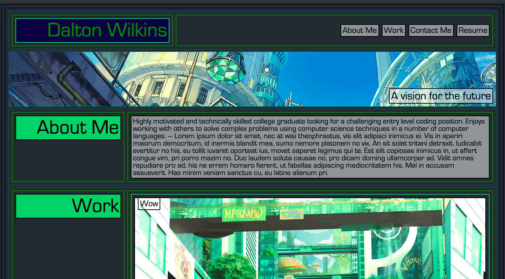
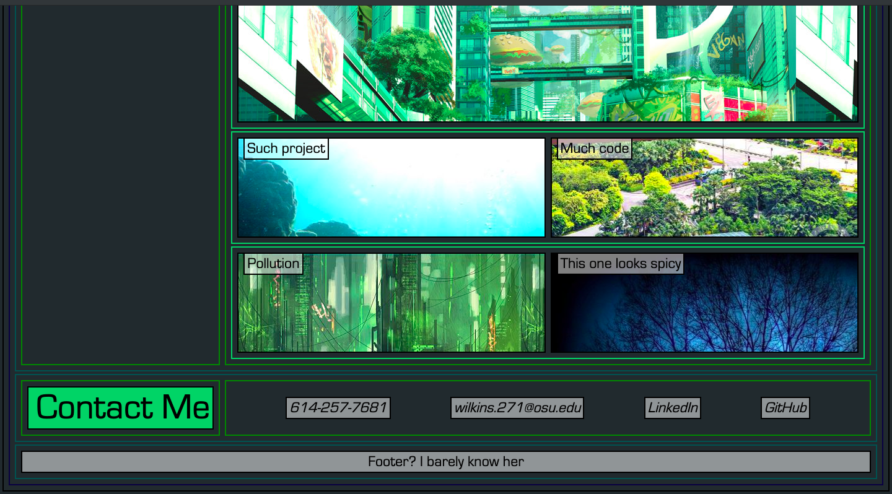

# CSS Portfolio

## Table of Contents
[Project Link](#Link)  
[Technologies](#Technologies)  
[Description](#Description)  
[Screenshots](#Screenshots)  
[License](#License)  
[Contact](#Contact)

## Link
https://dalto135.github.io/css-portfolio/

## Technologies
HTML and CSS

## Description
A portfolio website designed to both provide my personal information and demonstrate various skills using HTML and CSS.

## Screenshots

## License
MIT

## Contact
Dalton Wilkins - wilkins.271@osu.edu
